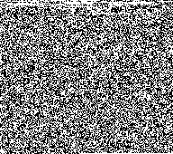

# Elevated 4k to Image & Back


## Overview

This is a guide on converting the amazing
["Elevated" 4k demo (2009)](https://www.pouet.net/prod_nfo.php?which=52938) 
(see also [source code](https://github.com/in4k/rgba_tbc_elevated_source) &
[Youtube Video](https://www.youtube.com/watch?v=jB0vBmiTr6o)) to an image file,
and then back to an executable.

Why? I find that having this demo displayed as a 1-bit black & white bitmap
image helps provide some context as to just how small 4k truly is. In the
image shown below, every single bit that makes up the **Elevated** demo is
shown - with white pixels for 1s and black pixels for 0s.



Compare to this low-resolution, compressed screenshot of the demo, at 18k, or
more than 3x the size!


### Requirements

This guide uses several standard-ish utilities available (or potentially even
preinstalled) on many Linux Distros. The expected utilities are:

* `wget` - for getting the demo
* `imagemagick` - for image conversion
* `unzip` - to decompress the zip file, of course!

You'll also presumably want a Windows machine to run the demo on. Fortunately,
with Windows 10, you can do all of the linux steps in WSL (Windows Subsystem
for Linux). Setting that up is beyond the scope of this article, see the
[excellent official docs](https://aka.ms/wsl2).

## Convert To Image

Let's create a PNG image from the "Elevated" 4k demo. Let's start by
downloading the demo.

```bash
## Download the file from the scene.org archives
wget https://files.scene.org/get/parties/2009/breakpoint09/in4k/rgba_tbc_elevated_2016.zip

## Decompress
unzip rgba_tbc_elevated_2016.zip

## "Convert" the file to a PBM file, by creating a header, and padding with zeroes to account
## for the 4066 byte file not fitting perfectly into 192 bit units (192x169.4166666...)

#   Create Header, split w/newlines
#   P4 = bitmap, 192x170 = size                           Generate 14 bytes of zeroes      Save to PBM file
#
cat <(echo -e "P4\n192 170\n") elevated_1920_1080.exe <(dd if=/dev/zero bs=1c count=14) > elev-192x170-zeropadded.pbm

## Convert this PBM to a PNG file
convert elev-192x170-zeropadded.pbm elev-192x170.png
```

You should now be able to open this `.png` file, and see the following image:


## Convert From Image To Exe

Now, let's turn that image file back to an EXE!

```bash
## Convert to Binary PBM file
convert elev-192x170.png elev-decoded-stage1.pbm

## Remove the header lines and write to exe
tail -n +4 elev-decoded-stage1.pbm > elevated-demo-decoded.exe
```

Now, give that EXE file a try!

## Credits

* The Elevated 4k Demo Authors (TBC and rgba / rgba and TBC)
* pouet.net
* scene.org
* authors of imagemagick, unzip, wget, bash, etc

